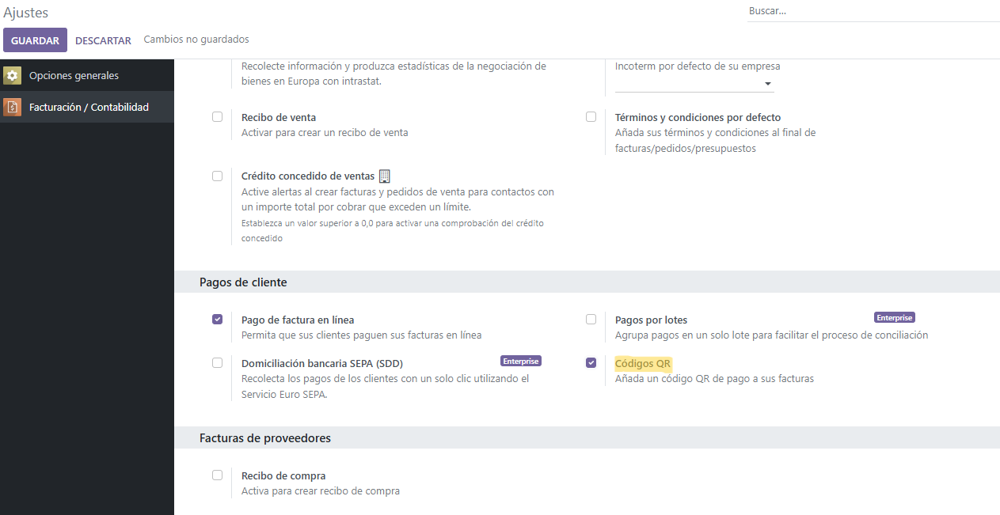
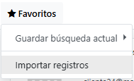
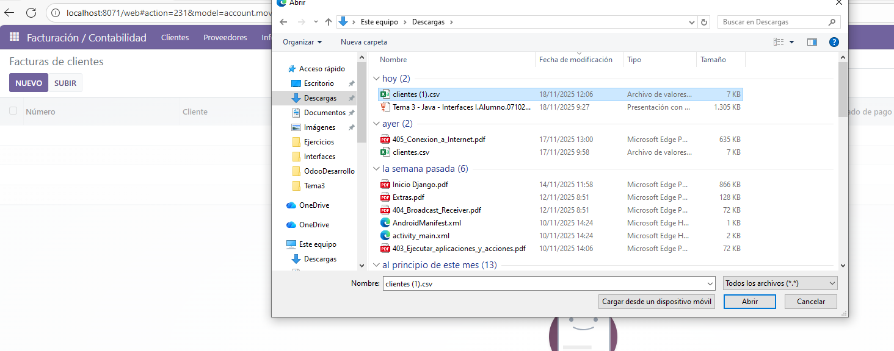
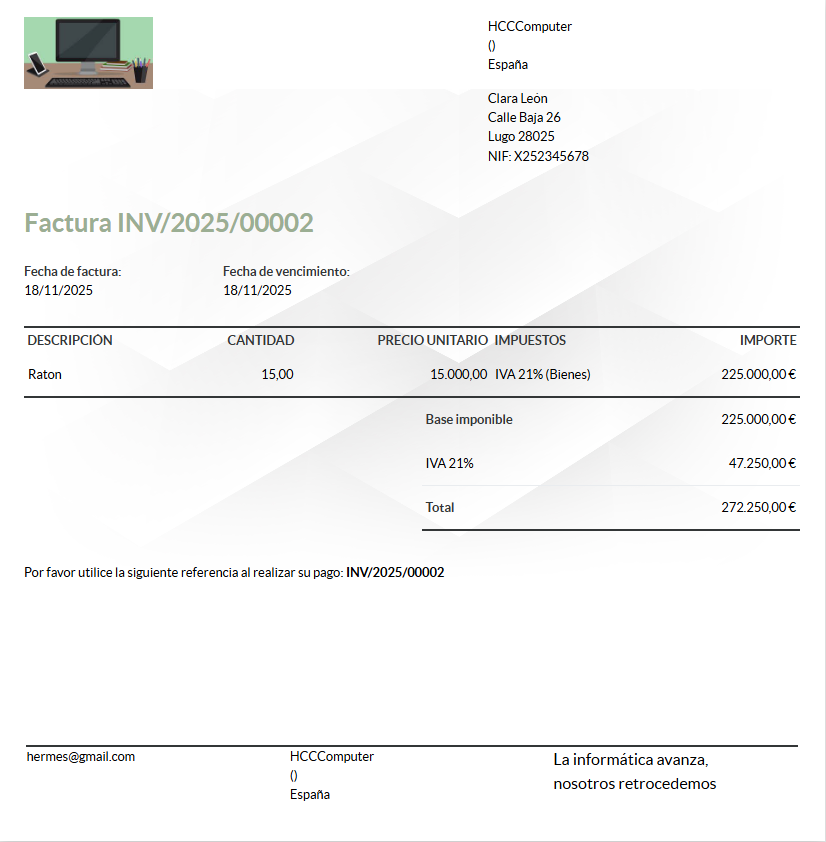

# Módulo facturación
## Primeros pasos
Lo primero que deberiamos realizar es la creacion de los usuarios correspondientes que podran acceder a nuestro Odoo, donde nosotros por ejemplo crearemos *segUser*

Una vez este ya este creado podremos logeranos o iniciar sesión con este.

Ahora vamos a implementar el uso de QR dentro de las facturas.

 **IMPORTANTE** este orden lo sigo por llevar una estructura de primero todo aquello que sea dentro de ajustes y ya luego nos iremos a la creacion de la facturas. 
 
 Para la implementacion de QR debemos ir a los ajustes dentro de facturacion y si bajamos veremos un apartado **Pagos de Clientes** donde aqui marcaremos la opcion *Codigos QR*.

Una vez ya tengamos esto implementado podemos ir directamente a la insercción de clientes. Para esto iremos a el apartado de **clientes** y una vez aqui le daremos a **favorito** y despues a **importar registros**.

Y aqui ya agregaremos la lista de clientes que tengamos, donde nosotros subiremos nuestro CSV

Una vez esto este hecho ya podremos empezar con la configuracion de las facturas donde lo primero que haremos es poner el nombre de nuestra empresa para esto iremos a **facturacion**, y despues es tan facil como ir a la factura y darle al primer paso que indica *Informacion de la compañia*. Y ya depues es la propia personalizacion de la factura. 

## Factura
Una vez tengamos ya todo hecho y enviemos la factura nos saldra nuestra factura:

[Factura](./factura/INV_2025_00002.pdf)

**IMPORTANTE** a la hora de poner la factura esta no se sube con la personalizacion que yo le he colocado, por lo que adjunto una visualizacion de como deberia quedar.

