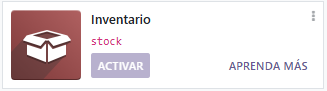
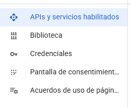
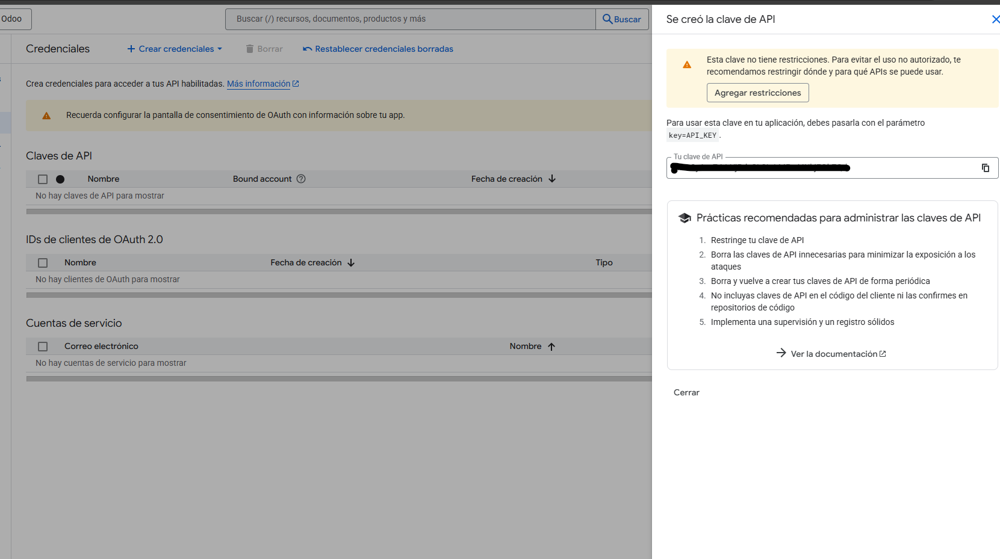
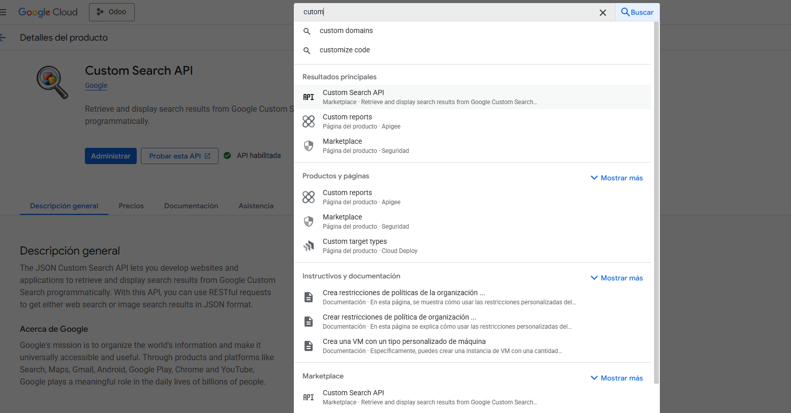
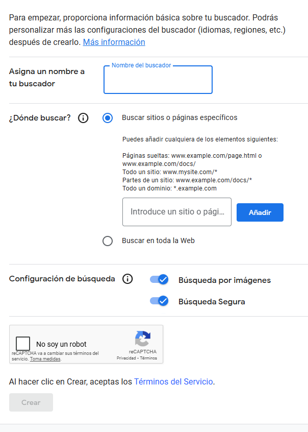
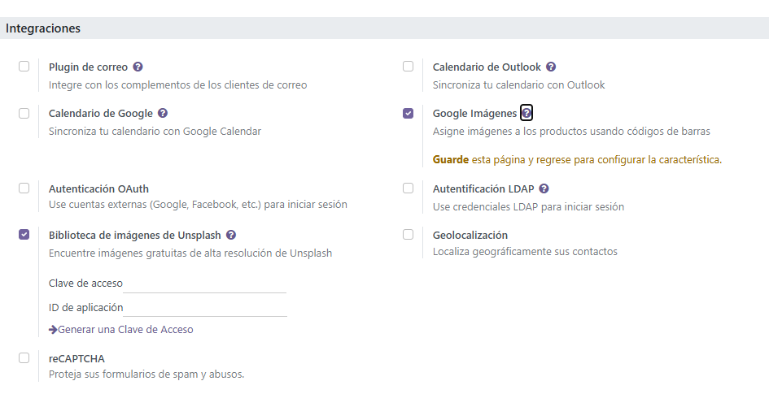
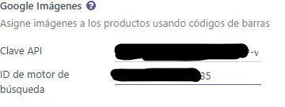
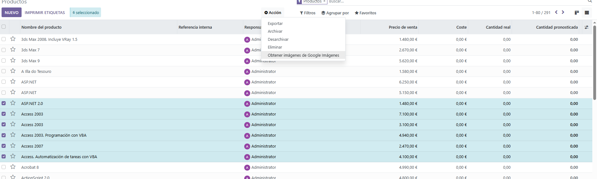
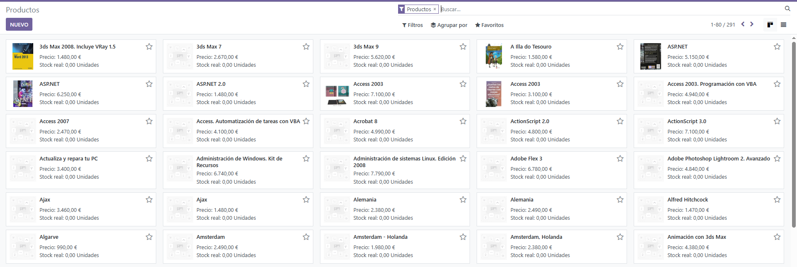

# Integración de servicios externos
## Primeros pasos
Lo primero que vamos a realizar es activar el modulo de *inventario* que par a esto tendremos que ir a odoo al apartado de aplicaciones y habilitarlo

Una vez tengamos esto añadiremos los productos que queramos dentro del invenatario, donde el proceso es el mismo que el añadido de clientes. Es decir, iremos al apartado de inventario productos y le daremos a **favorito** y despues a importar registros.

### Creacion clave API

Ahora iremos tenemos que conseguir una API Key (donde conseguiremos la de Google) donde iremos a: https://console.cloud.google.com/apis/dashboard. Cuando estemos logueado con nuestro usuarios ya podremos crear la API.

Lo primero que haremos es darle a crear nuevo proyecto, una vez ya lo tengamos creado, podremos ver el siguiente menu:

Ahora iremos al apartado de Credenciales y crearemos unas credenciales.

Una vez ya tengamos esto creado pondremos lo siguiente en el filtro *Custom Search API* (o custom) y lo seleccionamos y activaremos el Custom Search API que nos sale

### Creacion motor busqueda

Una vez ya tengamos esto ya podremos ir a crear un nuevo motor busqueda: https://programmablesearchengine.google.com/about/

Cuando estemos en esta pagina le daremos a comenzar, y seguiremos los pasos de creacion correspondientes.

**IMPORTANTE** cuando le demos a crear nos saldra un boton despues de *visit link* y *personalizacion* y nosotros pincharemos en *personalizacion*. Donde nos saldra la siguiente pestaña.

Aqui nos quedaremos con el *ID buscador*

Ahora que tenemos todo esto creado nos iremos a Odoo y activaremos **Google Imagenes**, para esto iremos simplemente a ajustes y buscaremos una pestaña o apartado llamado *Integraciones* y ya ahi dentro veremos Google Imagenes. 

La marcaremos y guardaremos una vez este guardado veremos que nos sale uno nuevos datos a rellenar *Clave API* y *Id motor de buscador* aqui pondremos nuestra Clave apy y la id de nuestro motor

### Visualizacion de las imagenes
A continuacion iremos a *Inventario* y solo tendremos que seleccionar los productos que queramos y darle a buscar a **Obtener imagen google**

Y ahora si vamos a nuestros productos veremos que tenemos imagen para esos productos
