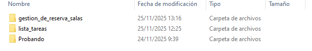
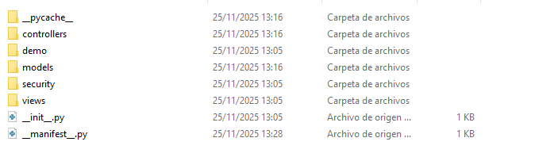
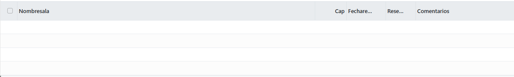
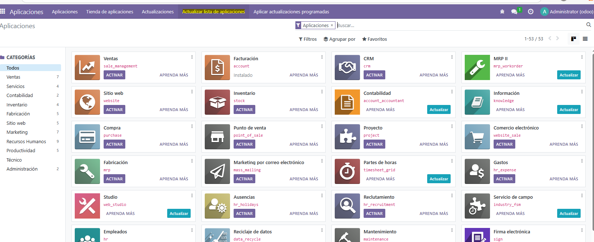
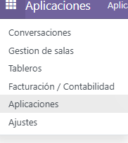
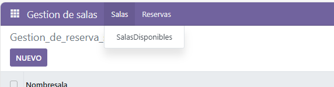
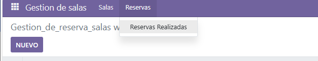

# Creación de un módulo básico
## Creacion del modulo
Para empezar lo primero que haremos es entrar a la bash de docker por lo que usaremos el comando 
```bash 
docker exec -ti (codigo del contenedor) bash
``` 
Una vez tengamos la bash activa ya podremos usar el comando:  `odoo scaffold nombreModulo /mnt/extra-addons/`, es importante marcar que estos modulos siempre se guardan dentro de **extra-addons**.

Una vez lo hayamos ejecutado veremos que se ha creado las carpetas con la que trabajaremos



## Configuracion / modificacion
Ahora pasaremos a lo verdaderamente importante que es la modificacion de los archivos. Aqui dentro veremos varias carpetas.



Aqui las carpetas que usaremos son las siguiente:
-  **demo**: incluye datos demos para el model
-  **models**: aqui es donde se definen los datos y campos
-  **views**: se encuentran las vistas de nuestro modulo

Aqui para nuestra practica lo primero que modificamos es el *models/models.py*

```py
# -*- coding: utf-8 -*-

from odoo import models, fields, api


class gestion_de_reserva_salas(models.Model):
    _name = 'gestion_de_reserva_salas.gestion_de_reserva_salas'
    _description = 'gestion_de_reserva_salas.gestion_de_reserva_salas'

    nombreSala = fields.Char()
    cap = fields.Integer()
    fechaReserva = fields.Date()
    reservada = fields.Boolean()     
    comentarios = fields.Text()
```

Aqui lo que haremos es poner los campos que tendremos.

Una vez tengamos esto modificado, nos pasaremos a la modificacion del archivo *views/views.xml* 
```xml
<odoo>
  <data>
    <!-- explicit list view definition -->

    <record model="ir.ui.view" id="gestion_de_reserva_salas.list">
      <field name="name">Gestion_de_reserva_salas list</field>
      <field name="model">gestion_de_reserva_salas.gestion_de_reserva_salas</field>
      <field name="arch" type="xml">
        <tree>
          <field name="nombreSala"/>
          <field name="cap"/>
          <field name="fechaReserva"/>
          <field name="reservada"/>
          <field name="comentarios"/>
        </tree>
      </field>
    </record>


    <!-- actions opening views on models -->

    <record model="ir.actions.act_window" id="gestion_de_reserva_salas.action_window">
      <field name="name">Gestion_de_reserva_salas window</field>
      <field name="res_model">gestion_de_reserva_salas.gestion_de_reserva_salas</field>
      <field name="view_mode">tree,form</field>
    </record>

    <!-- Top menu item -->

    <menuitem name="Gestion de salas" id="gestion_de_reserva_salas.menu_root"/>

    <!-- menu categories -->

    <menuitem name="Salas" id="gestion_de_reserva_salas.menu_1" parent="gestion_de_reserva_salas.menu_root"/>
    <menuitem name="Reservas" id="gestion_de_reserva_salas.menu_2" parent="gestion_de_reserva_salas.menu_root"/>

    <!-- actions -->

    <menuitem name="SalasDisponibles" id="gestion_de_reserva_salas.menu_1_salas" parent="gestion_de_reserva_salas.menu_1"
              action="gestion_de_reserva_salas.action_window"/>
    <menuitem name="Reservas Realizadas" id="gestion_de_reserva_salas.menu_2_reservas" parent="gestion_de_reserva_salas.menu_2"/>
  </data>
</odoo>
```
Aqui lo que hemos modificado es lo siguiente:
```xml
<tree>
          <field name="nombreSala"/>
          <field name="cap"/>
          <field name="fechaReserva"/>
          <field name="reservada"/>
          <field name="comentarios"/>
        </tree>
```
Estos son los campos que nos mostraran.



Otra modificaciones que hemos realizado es:
```xml
<menuitem name="Gestion de salas" id="gestion_de_reserva_salas.menu_root"/>
<menuitem name="Salas" id="gestion_de_reserva_salas.menu_1" parent="gestion_de_reserva_salas.menu_root"/>
<menuitem name="Reservas" id="gestion_de_reserva_salas.menu_2" parent="gestion_de_reserva_salas.menu_root"/>

    <!-- actions -->

    <menuitem name="SalasDisponibles" id="gestion_de_reserva_salas.menu_1_salas" parent="gestion_de_reserva_salas.menu_1"
              action="gestion_de_reserva_salas.action_window"/>
    <menuitem name="Reservas Realizadas" id="gestion_de_reserva_salas.menu_2_reservas" parent="gestion_de_reserva_salas.menu_2"/>
```
Aqui es donde definimos los menus donde nos econtramos:
- `<menuitem name="Gestion de salas" id="gestion_de_reserva_salas.menu_root"/>` esta linea es la que define el menu padre

- `<menuitem name="Salas" id="gestion_de_reserva_salas.menu_1" parent="gestion_de_reserva_salas.menu_root"/>` este es un menu dentro del padre que se llamara Salas
  
- `<menuitem name="Reservas" id="gestion_de_reserva_salas.menu_2"    parent="gestion_de_reserva_salas.menu_root"/>` menu dentro del padre que se llamara Reservas 

- `<menuitem name="SalasDisponibles" id="gestion_de_reserva_salas.menu_1_salas" parent="gestion_de_reserva_salas.menu_1" action="gestion_de_reserva_salas.action_window"/>` este menu como podemos ver en *parent="gestion_de_reserva_salas.menu_1* esta dentro de Salas
- `<menuitem name="Reservas Realizadas" id="gestion_de_reserva_salas.menu_2_reservas" parent="gestion_de_reserva_salas.menu_2"/>` este menu como podemos ver en *parent="gestion_de_reserva_salas.menu_2* esta dentro de Reservas

Estructura de los menus:
```
Gestión de salas
   |
   |-- Salas
   |     |
   |     |--Salas Disponibles
   |
   |- Reservas
         |
         |- Reservas realizadas (este menú no tendrá acción asociada)
```
Ahora lo ultimo por tocar sera el fichero \_\_manifest\_\_ y descomentar la siguiente linea *'security/ir.model.access.csv',*


## Agregar aplicacion
Dentro de Odoo iremos a *Aplicaciones* y le daremos a Actualizar 


Ahora instalaremos la aplicacion
![Error](./UT05/../imagenes/instalacionMod.png

Y ya tendremos nuestros menu y modulo






