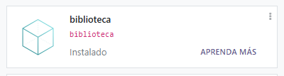
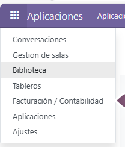
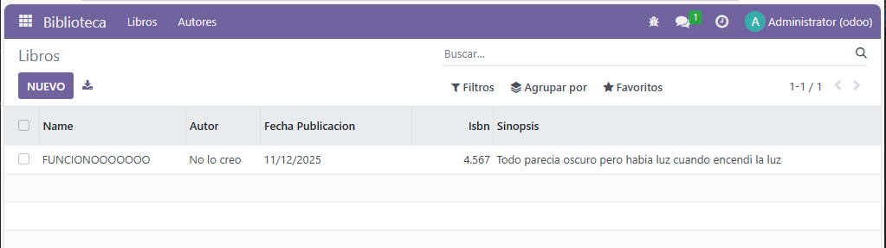
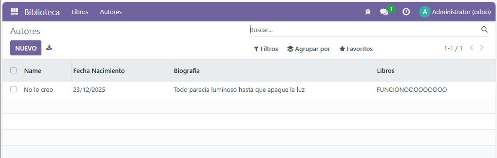

# Módulo con dos modelos
En esta practica seguiremos la misma estructura que la practica **pr0501**, pero con la diferencia de que trabajadremos con models, views y menus con ficheros creado por nosotros.

- models/autores.py

```python
# -*- coding: utf-8 -*-

from odoo import models, fields, api

class autores(models.Model):
    _name = 'biblioteca.autores'
    _description = 'biblioteca.biblioteca'

    name = fields.Char()
    fecha_nacimiento = fields.Date()
    biografia = fields.Text()
    libros = fields.Text()
```

- models/libros.py
```python
# -*- coding: utf-8 -*-

from odoo import models, fields, api

class libros(models.Model):
    _name = 'biblioteca.libros'
    _description = 'biblioteca.biblioteca'

    name = fields.Char() 
    autor = fields.Char()
    fecha_publicacion = fields.Date()
    isbn = fields.Integer()
    sinopsis = fields.Text()
```
- models/\_\_init\_\_.py
```python
# -*- coding: utf-8 -*-

from . import autores
from . import libros
```
- security/ir.model.access.csv
```csv
id,name,model_id:id,group_id:id,perm_read,perm_write,perm_create,perm_unlink
access_libros,biblioteca libros Access,model_biblioteca_libros,base.group_user,1,1,1,1
access_autores,biblioteca autores Access,model_biblioteca_autores,base.group_user,1,1,1,1
```

Ahora pasaremos a los views
- views/vista_autor.xml 
```xml
<odoo>
    <data>
        <record model="ir.ui.view" id="biblioteca.autores_list">
            <field name="name">biblioteca.autores list</field>
            <field name="model">biblioteca.autores</field>
            <field name="arch" type="xml">
                <tree>
                    <field name="name"/>
                    <field name="fecha_nacimiento"/>
                    <field name="biografia"/>
                    <field name="libros"/>
                </tree>
            </field>
        </record>

        <record model="ir.actions.act_window" id="biblioteca.autores_action">
            <field name="name">Autores</field>
            <field name="res_model">biblioteca.autores</field>
            <field name="view_mode">tree,form</field>
        </record>
    </data>
</odoo>
```
- views/vista_libros.xml
```xml
<odoo>
    <data>
        <record model="ir.ui.view" id="biblioteca.libros_list">
            <field name="name">biblioteca.libros.list</field>
            <field name="model">biblioteca.libros</field>
            <field name="arch" type="xml">
                <tree>
                    <field name="name"/>
                    <field name="autor"/>
                    <field name="fecha_publicacion"/>
                    <field name="isbn"/>
                    <field name="sinopsis"/>
                </tree>
            </field>
        </record>

        <record model="ir.actions.act_window" id="biblioteca.libros_action">
            <field name="name">Libros</field>
            <field name="res_model">biblioteca.libros</field>
            <field name="view_mode">tree,form</field>
        </record>
    </data>
</odoo>
```
- views/menus.xml
```xml
<odoo>
    <data>
        <menuitem 
            name="Biblioteca" 
            id="menu_biblioteca_root" 
            sequence="10"
            groups="base.group_user"/>

        <menuitem 
            name="Libros" 
            id="menu_biblioteca_libros" 
            parent="menu_biblioteca_root" 
            action="biblioteca.libros_action" 
            sequence="10"/>

        <menuitem 
            name="Autores" 
            id="menu_biblioteca_autores" 
            parent="menu_biblioteca_root" 
            action="biblioteca.autores_action" 
            sequence="20"/>
            
        <menuitem 
            name="Configuración" 
            id="menu_biblioteca_configuration" 
            parent="menu_biblioteca_root" 
            sequence="30"/>
    </data>
</odoo>
```
- \_\_manifest\_\_.py: Agregaremos en data lo que hemos creado

```xml
    'data': [
        'security/ir.model.access.csv',
        'views/templates.xml',
        'views/vista_autor.xml',
        'views/vista_libros.xml',
        'views/menus.xml',
    ],
```




