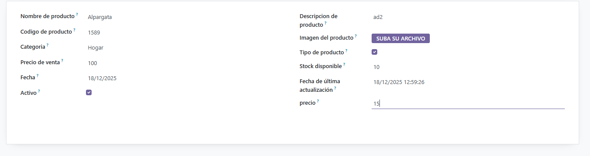

# Campos del modelo
Empezamos modificando el models, donde le pondremos los campos correspondientes.
```py
# -*- coding: utf-8 -*-

from odoo import models, fields, api


class gestion_productos(models.Model):
    _name = 'gestion_productos.gestion_productos'
    _description = 'gestion_productos.gestion_productos'

    name = fields.Char(
        string = "Nombre de producto"
    )

    descripcion = fields.Char(
        string = "Descripcion de producto"
    )

    codigo = fields.Char(
        string = "Codigo de producto",
        required=True
    )

    imagen =  fields.Binary(
        string='Imagen del producto'
    )

    categoria = fields.Selection([
        ("jardin","Jardin"),
        ("hogar", "Hogar"),
        ("electrodomesticos", "Electrodomestico")
    ],        
        string="Categoria"
    )
    
    tipo = fields.Boolean(
        string = "Tipo de producto"
    )

    venta = fields.Integer(
        string='Precio de venta'
    )
     
    stock = fields.Integer(
        string='Stock disponible'
    )
 
    fecha = fields.Date(
        string='Fecha',
        default=fields.Date.context_today,
    )

    actualizacion = fields.Datetime(
        string='Fecha de última actualización',
        default=fields.Datetime.now,
    )
    
    activo = fields.Boolean(
        string = "Activo",
        default=True
    )

    precio = fields.Float(
        string='precio',
        digits=(10, 2)
    )   
```

Campos:
- **name**: Nombre del producto
- **descripcion**: Descripcion del producto
- **codigo**: Codigo del producto, aqui algo a destacar es que este campo es obligatorio
- **imagen**: Imagen de producto, donde se usa el *Binary*
- **categoria**: Este campo es la categoria del producto, donde usamos un Selection con unos valores
- **tipo**: Este es un booleano, que lo que indica el tipo
- **venta**: Este campo marcamos el campo de precio de venta
- **stock**: Este campo es para indicar la cantidad de stock
- **fecha**: Este campo es para poner la fecha, la cual es tipo Date
- **actualizacion**: Este campo pone la fecha de actualizacion al momento en el que se esta usamos DateTime
- **activo**: Este campo es para indicar Activo
- **precio**: Este campo nos pone el precio, donde le marcamos que solo tendra 2 decimales con ```digits=(10, 2)```

## Codigos modificados
```xml
<odoo>
  <data>
    <!-- explicit list view definition -->

    <record model="ir.ui.view" id="gestion_productos.list">
      <field name="name">gestion_productos list</field>
      <field name="model">gestion_productos.gestion_productos</field>
      <field name="arch" type="xml">
        <tree>
          <field name="name"/>
          <field name="descripcion"/>
          <field name="codigo"/>
          <field name="imagen"/>
          <field name="categoria"/>
          <field name="tipo"/>
          <field name="venta"/>
          <field name="stock"/>
          <field name="fecha"/>
          <field name="actualizacion"/>
          <field name="activo"/>
          <field name="precio"/>
        </tree>
      </field>
    </record>


    <!-- actions opening views on models -->

    <record model="ir.actions.act_window" id="gestion_productos.action_window">
      <field name="name">gestion_productos window</field>
      <field name="res_model">gestion_productos.gestion_productos</field>
      <field name="view_mode">tree,form</field>
    </record>


    <!-- server action to the one above -->
<!--
    <record model="ir.actions.server" id="gestion_productos.action_server">
      <field name="name">gestion_productos server</field>
      <field name="model_id" ref="model_gestion_productos_gestion_productos"/>
      <field name="state">code</field>
      <field name="code">
        action = {
          "type": "ir.actions.act_window",
          "view_mode": "tree,form",
          "res_model": model._name,
        }
      </field>
    </record>
-->

    <!-- Top menu item -->

    <menuitem name="gestion_productos" id="gestion_productos.menu_root"/>

    <!-- menu categories -->

    <menuitem name="gestion_productos" id="gestion_productos.menu_1" parent="gestion_productos.menu_root"/>
    

    <!-- actions -->

    <menuitem name="List" id="gestion_productos.menu_1_list" parent="gestion_productos.menu_1"
              action="gestion_productos.action_window"/>

  </data>
</odoo>
```

```csv
id,name,model_id:id,group_id:id,perm_read,perm_write,perm_create,perm_unlink
access_gestion_productos_gestion_productos,gestion_productos.gestion_productos,model_gestion_productos_gestion_productos,base.group_user,1,1,1,1
```

## Funcionamiento
