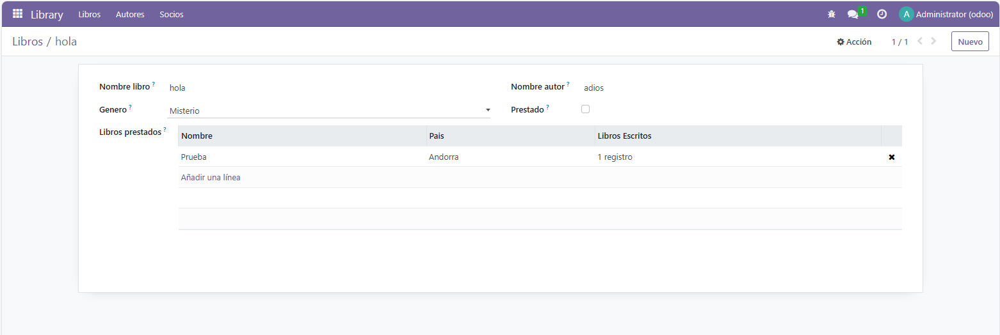
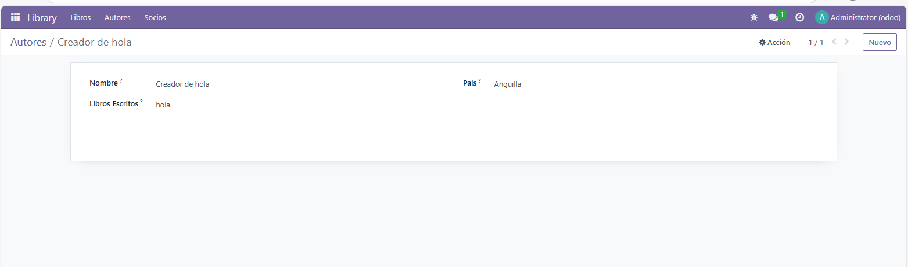
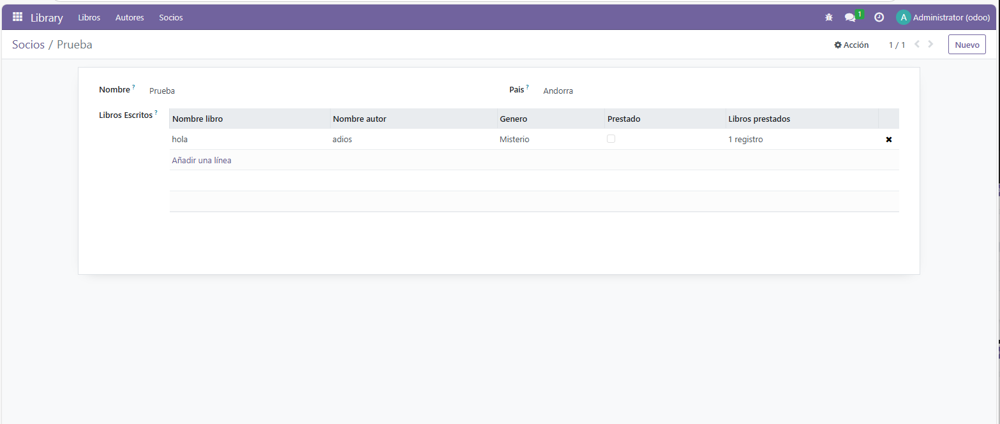

# Campos del modelo
Como siempre crearemos el modulo como hemos hecho hasta ahora. 

Cuando lo tengamos creado ya empezaremos a editar los archivos, lo primero que crearemos son los models correspondientes
- autores
- socios
- libros

### Autores
```py
# -*- coding: utf-8 -*-

from odoo import models, fields, api

class autores(models.Model):
    _name = 'library_hcc.autores'
    _description = 'library_hcc.library_hcc'

    name = fields.Char(
        string = "Nombre",
    )
    pais = fields.Many2one(
        comodel_name='res.country',
        string = "Pais",
    )

    libro_id = fields.Many2one(
        string='Libros Escritos',
        comodel_name='library_hcc.libros',
        ondelete='restrict',
    )
```
Como podemos ver tenemos los siguientes campos:
- **name**: Aqui decimos que este campo sera un tipo String, es decir, que se metera texto, el cual sera el nombre del autor.
- **pais**: En este campo hacemos una referencia al modelo existente de Odoo de *res.country*, para esto tendremos que crear una relacion de Many2one, ya que este es muchos a uno.
- **libro_id**: En este campo hacemos referencia a la tabla libros, ya que un autor puede escribir muchos libros, sabemos que tendremos que usar el Many2one. Es importante que lo que genera esta relacion es el *comodel_name='nombreDelModulo'*


### Libros
```py
# -*- coding: utf-8 -*-

from odoo import models, fields, api

class libros(models.Model):
    _name = 'library_hcc.libros'
    _description = 'library_hcc.library_hcc'

    name = fields.Char(
        string = "Nombre libro",
    )
    autor = fields.Char(
        string = "Nombre autor",
    )
    genero = fields.Selection(
        [
            ('novela', 'Novela'),
            ('drama', 'Drama'),
            ('ciencia ficcion', 'Ciencia ficcion'),
            ('miesterio', 'Misterio'),
            ('terror', 'Terror'),
            ('historico', 'Historico')
        ],
        string = "Genero",
    )
    prestado = fields.Boolean(
        string = "Prestado",
    )

    socios_id = fields.Many2many(
        string='Libros prestados',
        comodel_name='library_hcc.socios',
    )
```
Campos que encontramos mas relevantes:
- **genero**: Este campo como podemos observar es un *fields.Selection* es decir que le pasamos una lista de valores que podran ser relacionados
- **socios_id**: Este campo se relaciona directamente con el model de socios, para esta relacion encontramos que es un Many2many ya que esta relacion es un muchos a muchos

### Socios
```py
# -*- coding: utf-8 -*-

from odoo import models, fields, api

class socios(models.Model):
    _name = 'library_hcc.socios'
    _description = 'library_hcc.library_hcc'

    name = fields.Char(
        string = "Nombre",
    )
    pais = fields.Many2one(
        comodel_name='res.country',
        string = "Pais",
    )

    libro_id = fields.Many2many(
        string='Libros Escritos',
        comodel_name='library_hcc.libros',
    )
```
Campos mas relevante:
- **libro_id**: Como vimos en el *model.libros* creamos un campo que se relacionara con el campo **socios_id** de este modelo


## Codigos creados o modificados
### View de socios
```xml
<odoo>
    <data>
        <record model="ir.ui.view" id="library_hcc.socios_list">
            <field name="name">library_hcc.socios list</field>
            <field name="model">library_hcc.socios</field>
            <field name="arch" type="xml">
                <tree>
                    <field name="name"/>
                    <field name="pais"/>
                    <field name="libro_id"/>
                </tree>
            </field>
        </record>

        <record model="ir.actions.act_window" id="library_hcc.socios_action">
            <field name="name">Socios</field>
            <field name="res_model">library_hcc.socios</field>
            <field name="view_mode">tree,form</field>
        </record>
    </data>
</odoo>
```

**IMPORTANTE:** Una vez creado los models tenemos que recordar que debemos modificar los siguientes archivos: **\_\_init\_\_.py** y **ir.model.access.csv**
### \_\_init\_\_.py
```py
# -*- coding: utf-8 -*-

from . import libros
from . import autores
from . import socios

```
### ir.model.access.csv
```csv
id,name,model_id:id,group_id:id,perm_read,perm_write,perm_create,perm_unlink
access_library_hcc_autores,library_hcc autores,model_library_hcc_autores,base.group_user,1,1,1,1
access_library_hcc_libros,library_hcc libros,model_library_hcc_libros,base.group_user,1,1,1,1
access_library_hcc_socios,library_hcc socios,model_library_hcc_socios,base.group_user,1,1,1,1
```

### View de libros
```xml
<odoo>
    <data>
        <record model="ir.ui.view" id="library_hcc.libros_list">
            <field name="name">library_hcc.libros list</field>
            <field name="model">library_hcc.libros</field>
            <field name="arch" type="xml">
                <tree>
                    <field name="name"/>
                    <field name="autor"/>
                    <field name="genero"/>
                    <field name="prestado"/>
                    <field name="socios_id"/>
                </tree>
            </field>
        </record>

        <record model="ir.actions.act_window" id="library_hcc.libros_action">
            <field name="name">Libros</field>
            <field name="res_model">library_hcc.libros</field>
            <field name="view_mode">tree,form</field>
        </record>
    </data>
</odoo>
```

### View de autores
```xml
<odoo>
    <data>
        <record model="ir.ui.view" id="library_hcc.autores_list">
            <field name="name">library_hcc.autores list</field>
            <field name="model">library_hcc.autores</field>
            <field name="arch" type="xml">
                <tree>
                    <field name="name"/>
                    <field name="pais"/>
                    <field name="libro_id"/>
                </tree>
            </field>
        </record>

        <record model="ir.actions.act_window" id="library_hcc.autores_action">
            <field name="name">Autores</field>
            <field name="res_model">library_hcc.autores</field>
            <field name="view_mode">tree,form</field>
        </record>
    </data>
</odoo>
```

### Menus
```xml
<odoo>
    <data>
        <menuitem 
            name="Library" 
            id="menu_library_hcc_root" 
            sequence="10"
            groups="base.group_user"/>

        <menuitem 
            name="Libros" 
            id="menu_library_hcc_libros" 
            parent="menu_library_hcc_root" 
            action="library_hcc.libros_action" 
            sequence="10"/>

        <menuitem 
            name="Autores" 
            id="menu_library_hcc_autores" 
            parent="menu_library_hcc_root" 
            action="library_hcc.autores_action" 
            sequence="20"/>
            
        <menuitem 
            name="Socios" 
            id="menu_library_hcc_socios" 
            parent="menu_library_hcc_root" 
            action="library_hcc.socios_action"
            sequence="30"/>
    </data>
</odoo>
```

## Funcionamiento






