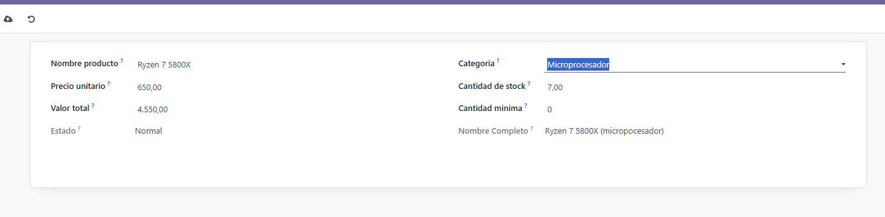
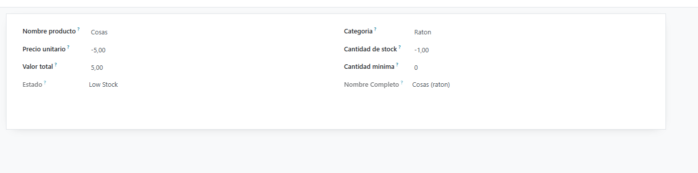
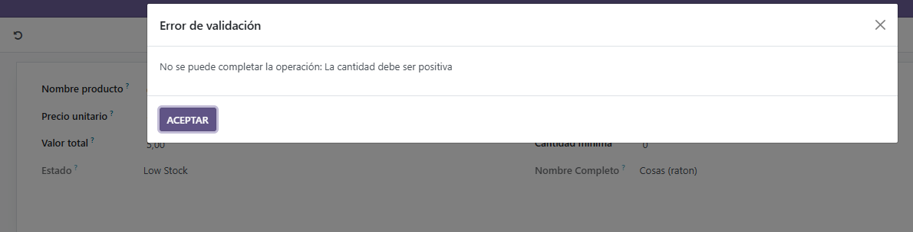
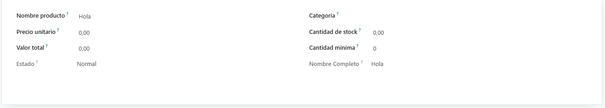
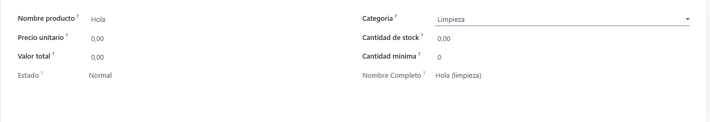

# Campos del modelo
Como siempre empezamos retocando el **models.py**

```py
from odoo import models, fields, api
from odoo.exceptions import ValidationError

class StockProduct(models.Model):
    _name = 'stock_product.stock_product'
    _description = 'Gestión de Stock'

    _sql_constraints = [
        ('unique_name', 'unique(name)', 'El nombre debe ser único'),
        ('check_quantity', 'CHECK(quantity >= 0)', 'La cantidad debe ser positiva'),
    ]

    name = fields.Char(
        string='Nombre producto', 
        required=True)
    category = fields.Selection([
        ('micropocesador', 'Microprocesador'),
        ('raton', 'Raton'),
        ('software', 'Software'),
        ('limpieza', 'Limpieza'),
    ], 
        string='Categoria', 
        required=True)
    
    price = fields.Float(string='Precio unitario')
    quantity = fields.Float(string='Cantidad de stock')
    total_value = fields.Float(
        string='Valor total', 
        compute='_compute_total', inverse='_inverse_total', 
        store=True)
    minimun_quantity = fields.Integer(
        string='Cantidad minima')
    
    stock_status = fields.Selection([
        ('normal', 'Normal'),
        ('low stock', 'Low Stock'),
    ], 
    string="Estado", 
    compute='_compute_stock_status')
    
    full_name = fields.Char(
        string='Nombre Completo', compute='_compute_full_name')
    
    @api.depends('price', 'quantity')
    def _compute_total(self):
        for record in self:
            record.total_value = record.price * record.quantity
    
    def _inverse_total(self):
        for record in self:
            if record.quantity and record.quantity != 0:
                record.price = record.total_value / record.quantity

    @api.depends('quantity', 'minimun_quantity')
    def _compute_stock_status(self):
        for rec in self:
            if rec.quantity < rec.minimun_quantity:
                rec.stock_status = 'low stock'
            else:
                rec.stock_status = 'normal'

    @api.depends('name', 'category')
    def _compute_full_name(self):
        for rec in self:
            rec.full_name = f"{rec.name} ({rec.category})" if rec.name and rec.category else rec.name

    @api.constrains('price')
    def _check_price(self):
        for rec in self:
            if rec.price < 0:
                raise ValidationError('El precio debe ser mayor que 0') 
```
Dentro de este model lo mas importante a destacar es:     
```py
_sql_constraints = [
        ('unique_name', 'unique(name)', 'El nombre debe ser único'),
        ('check_quantity', 'CHECK(quantity >= 0)', 'La cantidad debe ser positiva'),
    ]
```

Aqui lo que hacemos es decir que el nombre es unico ```('unique_name', 'unique(name)', 'El nombre debe ser único')```. Con la siguiente linea verificamos que la cantidad debe ser mayor o igual a 0 ```('check_quantity', 'CHECK(quantity >= 0)', 'La cantidad debe ser positiva')```


Lo siguiente interesante que podemos encontrar es las lineas que tenemos en algunos campos ``` compute='_compute_stock_status'``` con esto llamamos a las funciones correspondientes. 

```py
    @api.depends('price', 'quantity')
    def _compute_total(self):
        for record in self:
            record.total_value = record.price * record.quantity
    
    def _inverse_total(self):
        for record in self:
            if record.quantity and record.quantity != 0:
                record.price = record.total_value / record.quantity

    @api.depends('quantity', 'minimun_quantity')
    def _compute_stock_status(self):
        for rec in self:
            if rec.quantity < rec.minimun_quantity:
                rec.stock_status = 'low stock'
            else:
                rec.stock_status = 'normal'

    @api.depends('name', 'category')
    def _compute_full_name(self):
        for rec in self:
            rec.full_name = f"{rec.name} ({rec.category})" if rec.name and rec.category else rec.name

    @api.constrains('price')
    def _check_price(self):
        for rec in self:
            if rec.price < 0:
                raise ValidationError('El precio debe ser mayor que 0') 
```

Todas estas funciones se juntan a los campos y hacen que se cumplan estas condiciones

## Archivos modificados
```csv
id,name,model_id:id,group_id:id,perm_read,perm_write,perm_create,perm_unlink
access_stock_product,access_stock_product,model_stock_product_stock_product,base.group_user,1,1,1,1
```

```xml
<odoo>
    <record model="ir.ui.view" id="view_stock_product_tree">
        <field name="name">stock.product.tree</field>
        <field name="model">stock_product.stock_product</field>
        <field name="arch" type="xml">
            <tree>
                <field name="full_name"/>
                <field name="category"/>
                <field name="price"/>
                <field name="quantity"/>
                <field name="total_value"/>
                <field name="stock_status"/>
            </tree>
        </field>
    </record>

    <record model="ir.actions.act_window" id="action_stock_product">
        <field name="name">Productos de Stock</field>
        <field name="res_model">stock_product.stock_product</field>
        <field name="view_mode">tree,form</field>
    </record>

    <menuitem name="Stock Management" id="menu_stock_root"/>
    <menuitem name="Productos" id="menu_stock_product" parent="menu_stock_root" action="action_stock_product"/>
</odoo>
```


## Funcionamiento








