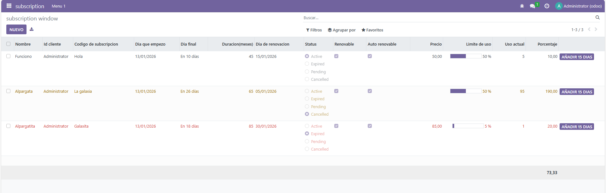

# Vista de tipo lista
En esta practica vamos a desarrollar un modulo, con una vista completa y editada.

Lo primero que realizamos es la creacion del archivo **models.py**

## Models

```py
# -*- coding: utf-8 -*-

from odoo import models, fields, api


class subscription(models.Model):
    _name = 'subscription.subscription'
    _description = 'subscription.subscription'

    name = fields.Char(
        required=True,
        string='Name', 
    )

    customer_id = fields.Many2one(
        string='customer',
        comodel_name='res.partner',
        ondelete='restrict',
        required=True,
    )

    subscription_code = fields.Char(
        string='subscription_code',
        required=True,
    )

    start_date = fields.Date(
        string='start_date',
        default=fields.Date.context_today,
        required=True,
    )

    end_date = fields.Date(
        string='end_date',
        default=fields.Date.context_today,
    )

    duration_months = fields.Integer(
        string='duration_months',
    )

    renewal_date = fields.Date(
        string='renewal_date',
        default=fields.Date.context_today,
    )

    status = fields.Selection(
        string='status',
        selection=[('active', 'Active'), ('expired', 'Expired'), ('pending', 'Pending'), ('cancelled', 'Cancelled')]
    )

    is_renewable = fields.Boolean(
        string='is_renewable',
    )

    auto_renewal = fields.Boolean(
        string='auto_renewal',
    )

    price = fields.Float(
        string='price',
    )

    usage_limit = fields.Integer(
        string='usage_limit',
    )

    current_usage = fields.Integer(
        string='current_usage',
    )

    use_percent = fields.Float(
        string='use_percent',
        compute='_porcentaje_uso',
    )    

    def add_dias(self):
        for rec in self:
            rec.duration_months += 15

    @api.depends('use_percent')
    def _porcentaje_uso(self):
        for record in self:
            record.use_percent = float(record.current_usage/record.usage_limit)*100
```

La estructura que encontramos en este model es la siguiente:

- name: Es el nombre, el cual es obligatorio
- customer_id: La id del customer, el cual es un campo Many2one
- subscription_code: Codigo de subscripcion y obligatorio
- start_date: Dia cuando empieza la subscripcion, tipo Date
- end_date: Dias para que acabe la subcripcion, que es tipo Date
- duration_months: Meses de duracion
- renewal_date: Dia de renovacion que es tipo Date
- status: Este campo podremos seleccionar entre unas tuplas los valores Active, Expired, Cancelled
- is_renewable: Campo booleano que nos permite indicar si se puede renovar
- price: Precio
- usage_limit: Campo de tipo flotante que indica el limite de uso que tendra la subscripcion
- current_usage: Campo de tipo integer que nos indica el uso actual del mismo
- use_percent: Uso de porcentaje de la subscricion

A mayores tambien nos encontramos lo siguiente:
```py
 def add_dias(self):
        for rec in self:
            rec.duration_months += 15

    @api.depends('use_percent')
    def _porcentaje_uso(self):
        for record in self:
            record.use_percent = float(record.current_usage/record.usage_limit)*100
```

**add_dias** este metodo lo usamos con un boton que tenemos dentro del archivo **view**. Este metodo lo que hace es sumarle 15 a duration_months

**_porcentaje_uso** lo que hace es sacar el porcentaje de uso, el cual lo sacamos con el uso actual dividido por el limite maximo uso

## Views

Ahora vamos a ver el fichero **view** el cual es el mas relevante a la hora de la vista

```xml
<odoo>
  <data>
    <!-- explicit list view definition -->

    <record model="ir.ui.view" id="subscription.list">
      <field name="name">subscription list</field>
      <field name="model">subscription.subscription</field>
      <field name="arch" type="xml">
        <tree decoration-danger="status=='expired'" decoration-warning="status=='cancelled'" limit="15">
          <field name="name" string="Nombre"/>
          <field name="customer_id" string="Id cliente"/>
          <field name="subscription_code" string="Codigo de subscripcion"/>
          <field name="start_date" string="Dia que empezo"/>
          <field name="end_date" 
            string="Dia final"
            widget="remaining_days"
            />
          <field name="duration_months" string="Duracion(meses)"/>
          <field name="renewal_date" string="Dia de renovacion"/>
          <field name="status" 
            string="Status"
            widget="radio"
            />
          <field name="is_renewable" string="Renovable"/>
          <field name="auto_renewal" string="Auto renovable"/>
          <field name="price" 
            string="Precio"
            attrs="{'invisible': [('status','=','cancelled')] }"
            />
          <field name="usage_limit" 
            string="Limite de uso"
            widget="progressbar"
            />
          <field name="current_usage" string="Uso actual"/>
          <field name="use_percent" 
            string="Porcentaje"
            avg="1"
            />
          <button name="add_dias"
            type="object"
            string="Añadir 15 dias"
            class="btn-primary"
            />
        </tree>
      </field>
    </record>


    <!-- actions opening views on models -->

    <record model="ir.actions.act_window" id="subscription.action_window">
      <field name="name">subscription window</field>
      <field name="res_model">subscription.subscription</field>
      <field name="view_mode">tree,form</field>
    </record>

    <!-- Top menu item -->

    <menuitem name="subscription" id="subscription.menu_root"/>

    <!-- menu categories -->

    <menuitem name="Menu 1" id="subscription.menu_1" parent="subscription.menu_root"/>

    <!-- actions -->

    <menuitem name="List" id="subscription.menu_1_list" parent="subscription.menu_1"
              action="subscription.action_window"/>

  </data>
</odoo>
```

Lo mas importante de view es la etiqueta **tree** y **field**

```xml
<tree decoration-danger="status=='expired'" decoration-warning="status=='cancelled'" limit="15">
          <field name="name" string="Nombre"/>
          <field name="customer_id" string="Id cliente"/>
          <field name="subscription_code" string="Codigo de subscripcion"/>
          <field name="start_date" string="Dia que empezo"/>
          <field name="end_date" 
            string="Dia final"
            widget="remaining_days"
            />
          <field name="duration_months" string="Duracion(meses)"/>
          <field name="renewal_date" string="Dia de renovacion"/>
          <field name="status" 
            string="Status"
            widget="radio"
            />
          <field name="is_renewable" string="Renovable"/>
          <field name="auto_renewal" string="Auto renovable"/>
          <field name="price" 
            string="Precio"
            attrs="{'invisible': [('status','=','cancelled')] }"
            />
          <field name="usage_limit" 
            string="Limite de uso"
            widget="progressbar"
            />
          <field name="current_usage" string="Uso actual"/>
          <field name="use_percent" 
            string="Porcentaje"
            avg="1"
            />
          <button name="add_dias"
            type="object"
            string="Añadir 15 dias"
            class="btn-primary"
            />
        </tree>
```

Lo primero a indicar es que tenemos la etiqueta padre **tree** donde dentro nos encontramos los hijos(**fields**).

### Tree

```xml
<tree decoration-danger="status=='expired'" decoration-warning="status=='cancelled'" limit="15">
```

Con esta linea de codigo lo que se le indica a todo el arbol y por ende a los hijos es lo siguiente:
- ```decoration-danger="status=='expired'"``` : con esto se le indica que el color de los campos va a ser de color rojo cuando el status sea igual a expired

- ```decoration-warning="status=='cancelled'"```: Con este en cambio se le indica que el color va a ser de color amarillo cuando el status sea igual a cancelled

- ```limit="15"```: Con esto se le indica que le maximo de campos que me mostrara por pantalla sera de 15

### Fields

Dentro de los campos mas importante o destacables encontramos los siguientes:

```xml
   <field name="end_date" 
        string="Dia final"
        widget="remaining_days"
  />
```
- ```name="end_date"```: Referencia al campo del model
- ```string="Dia final"```: Nombre con el que va a salir
- ```widget="remaining_days"```: Este widget lo que hace es que saque los dias que queden


```xml
    <field name="status" 
        string="Status"
        widget="radio"
    />
```
- ```widget="radio"```: Otro widget que lo que hace es que el valor salga con un radio( un checkbox redondo)

```xml
    <field name="price" 
        string="Precio"
        attrs="{'invisible': [('status','=','cancelled')] }"
    />
```
- ```attrs="{'invisible': [('status','=','cancelled')] }"```: Con esto se le indica que va a ser invisible cuando el status sea igual a cancelled

```xml
    <field name="usage_limit" 
        string="Limite de uso"
        widget="progressbar"
    />
```

- ```widget="progressbar"```: Este widget lo que hace es que podamos ver el campo con una barra de progeso

```xml
    <field name="use_percent" 
        string="Porcentaje"
        avg="1"
    />
```

- ```avg="1"```: Con esto le decimos que haga la media del campo use_percent

```xml
    <button name="add_dias"
        type="object"
        string="Añadir 15 dias"
        class="btn-primary"
    />
```

Con esta etiqueta **button** indicamos que vamos a poner un boton.
- ```name="add_dias"```: Esto hace referencia al metodo add_dias que tenemos en el models
- ```type="object"```: Le indicamos que el tipo va a ser un object ya que este nos indica que va a ejecutar un metodo definido
- ```class="btn-primary"```: Marcamos que es un boton de tipo primario


## Comprobacion



