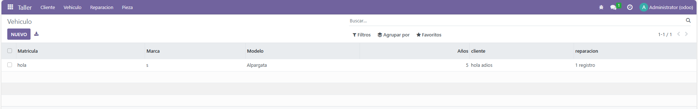
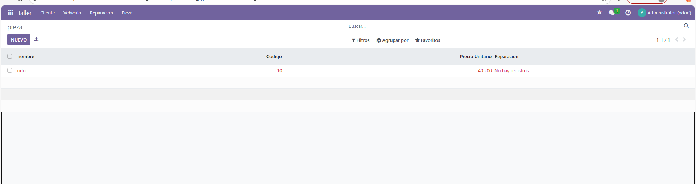
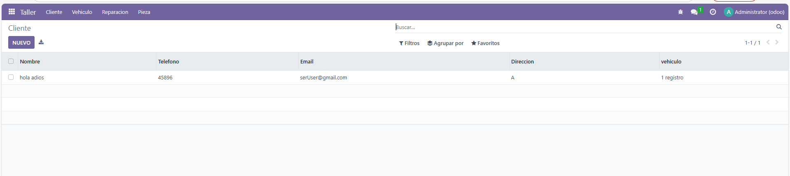
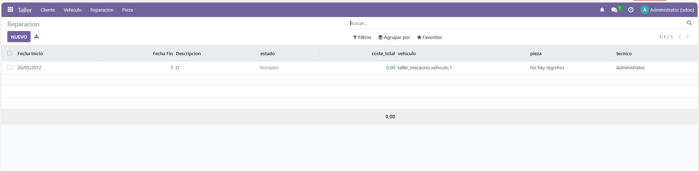

# Gestión de un taller mecánico

Practica de repaso de todos los fundamentos, para esta practica seguimos todas las practicas anteriores

## Models
**models/cliente.py**
```py
# -*- coding: utf-8 -*-

from odoo import models, fields, api

class cliente(models.Model):
    _name = 'taller_mecacino.cliente'
    _description = 'taller_mecacino.cliente'

    name = fields.Char(
        string='Nombre'
    )
    telefono = fields.Char()
    email = fields.Char()
    direccion = fields.Text()
    
    vehiculo_ids = fields.One2many(
        string='vehiculo',
        comodel_name='taller_mecacino.vehiculo',
        inverse_name='cliente_id',
    )
```
<hr>

**models/vehiculo.py**
```py
# -*- coding: utf-8 -*-

from odoo import models, fields, api

class vehiculo(models.Model):
    _name = 'taller_mecacino.vehiculo'
    _description = 'taller_mecacino.vehiculo'

    matricula = fields.Char()
    marca = fields.Char()
    modelo = fields.Char()
    anio = fields.Integer(
        string='Años',
    )
    cliente_id = fields.Many2one(
        string='cliente',
        comodel_name='taller_mecacino.cliente',
        ondelete='restrict',
    )
    
    reparacion_ids = fields.One2many(
        string='reparacion',
        comodel_name='taller_mecacino.reparacion',
        inverse_name='vehiculo_id',
    )
```
<hr>

**models/pieza.py**
```py
# -*- coding: utf-8 -*-

from odoo import models, fields, api

class pieza(models.Model):
    _name = 'taller_mecacino.pieza'
    _description = 'taller_mecacino.pieza'

    _sql_constraints = [
        ('check_precio','check(precio_unitario >0 )','El precio debe ser mayor de 0')
    ]

    name = fields.Char(
        string='nombre'
    )
    codigo = fields.Integer()
    precio_unitario = fields.Float()
    
    reparacion_ids = fields.Many2many(
        string='Reparacion',
        comodel_name='taller_mecacino.reparacion',
    )
```
<hr>

**models/reparacion.py**
```py
# -*- coding: utf-8 -*-

from odoo import models, fields, api

class reparacion(models.Model):
    _name = 'taller_mecacino.reparacion'
    _description = 'taller_mecacino.reparacion'

    fecha_inicio = fields.Char()
    fecha_fin = fields.Integer()
    descripcion = fields.Text()
    estado = fields.Selection(
        string='estado',
        selection=[('borrador', 'Borrador'), ('en_curso', 'En curso'), ('finalizada', 'Finalizada')]
    )
    
    coste_total = fields.Float(
        string='coste_total',
        compute="_calculo_coste",
    )
    
    vehiculo_id = fields.Many2one(
        string='vehiculo',
        comodel_name='taller_mecacino.vehiculo',
        ondelete='restrict',
    )
    
    pieza_ids = fields.Many2many(
        string='pieza',
        comodel_name='taller_mecacino.pieza',
    )
    
    tecnico_id = fields.Many2one(
        string='tecnico',
        comodel_name='res.users',
        ondelete='restrict',
    )
    
    def _cualculo_coste(self):
        for rec in self:
            rec.coste_total = rec.piezas_ids.mapped("precio_unitario")
```

## Views
**views/view_vehiculo.xml**
```xml
<odoo>
    <data>
        <record model="ir.ui.view" id="taller_mecacino.vehiculo_list">
        <field name="name">vehiculo list</field>
        <field name="model">taller_mecacino.vehiculo</field>
        <field name="arch" type="xml">
            <tree>
                <field name="matricula"/>
                <field name="marca"/>
                <field name="modelo"/>
                <field name="anio"/>
                <field name="cliente_id"/>
                <field name="reparacion_ids"/>
            </tree>
        </field>
        </record>

        <record model="ir.actions.act_window" id="taller_mecacino.action_window_vehiculo">
        <field name="name">Vehiculo</field>
        <field name="res_model">taller_mecacino.vehiculo</field>
        <field name="view_mode">tree,form</field>
        </record>
    </data>
</odoo>
```
<hr>

**views/view_reparacion.xml**

```xml
<odoo>
    <data>
        <record model="ir.ui.view" id="taller_mecacino.reparacion_list">
        <field name="name">reparacion list</field>
        <field name="model">taller_mecacino.reparacion</field>
        <field name="arch" type="xml">
            <tree>
                <field name="fecha_inicio"/>
                <field name="fecha_fin"/>
                <field name="descripcion"/>
                <field name="estado"
                    decoration-muted = "estado == 'borrador'"
                    decoration-info = "estado == 'en curso'"
                    decoration-success = "estado == 'finalizado'"
                />
                <field name="coste_total"
                    decoration-danger= "coste_total &gt; 500"
                    decoration-warning= "coste_total &gt;= 100 and coste_total &lt;= 500"
                    decoration-success= "coste_total &lt; 100"
                    avg = "1"
                    sum ="1"
                />
                <field name="vehiculo_id"/>
                <field name="pieza_ids"/>
                <field name="tecnico_id"/>
                
            </tree>
        </field>
        </record>

        <record model="ir.actions.act_window" id="taller_mecacino.action_window_reparacion">
            <field name="name">Reparacion</field>
            <field name="res_model">taller_mecacino.reparacion</field>
            <field name="view_mode">tree,form</field>
        </record>
    </data>
</odoo>
```
<hr>

**vies/view_pieza.xml**
```xml
<odoo>
    <data>
        <record model="ir.ui.view" id="taller_mecacino.pieza_list">
        <field name="name">pieza list</field>
        <field name="model">taller_mecacino.pieza</field>
        <field name="arch" type="xml">
            <tree decoration-danger="precio_unitario &gt; 100" decoration-success="precio_unitario &lt; 10" decoration-warning="precio_unitario &lt; 100 and precio_unitario &gt; 10">
                <field name="name"/>
                <field name="codigo"/>
                <field name="precio_unitario"
                    decoration-success= "precio_unitario &lt; 10"
                    decoration-danger= "precio_unitario &gt; 100"
                />
                <field name="reparacion_ids"/>
            </tree>
        </field>
        </record>

        <record model="ir.actions.act_window" id="taller_mecacino.action_window_pieza">
        <field name="name">pieza</field>
        <field name="res_model">taller_mecacino.pieza</field>
        <field name="view_mode">tree,form</field>
        </record>
    </data>
</odoo>
```
<hr>

**views/view_cliente.xml**
```xml
<odoo>
    <data>
        <record model="ir.ui.view" id="taller_mecacino.cliente_list">
        <field name="name">cliente list</field>
        <field name="model">taller_mecacino.cliente</field>
        <field name="arch" type="xml">
            <tree>
                <field name="name"/>
                <field name="telefono"/>
                <field name="email"/>
                <field name="direccion"/>
                <field name="vehiculo_ids"/>
            </tree>
        </field>
        </record>

        <record model="ir.actions.act_window" id="taller_mecacino.action_window_cliente">
            <field name="name">Cliente</field>
            <field name="res_model">taller_mecacino.cliente</field>
            <field name="view_mode">tree,form</field>
        </record>
    </data>
</odoo>
```
<hr>

**views/menu.xml**
```xml
<odoo>
    <data>
        <menuitem 
            name="Taller" 
            id="taller_mecacino_root" 
            sequence="10"
            groups="base.group_user"/>

        <menuitem 
            name="Cliente" 
            id="menu_cliente" 
            parent="taller_mecacino_root" 
            action="taller_mecacino.action_window_cliente" 
            sequence="10"/>

        <menuitem 
            name="Vehiculo" 
            id="menu_vehiculo" 
            parent="taller_mecacino_root" 
            action="taller_mecacino.action_window_vehiculo" 
            sequence="20"/>
            
        <menuitem 
            name="Reparacion" 
            id="menu_reparacion" 
            parent="taller_mecacino_root" 
            action="taller_mecacino.action_window_reparacion"
            sequence="30"/>

        <menuitem 
            name="Pieza" 
            id="menu_pieza" 
            parent="taller_mecacino_root" 
            action="taller_mecacino.action_window_pieza"
            sequence="40"/>
    </data>
</odoo>
```

## Funcionamiento



