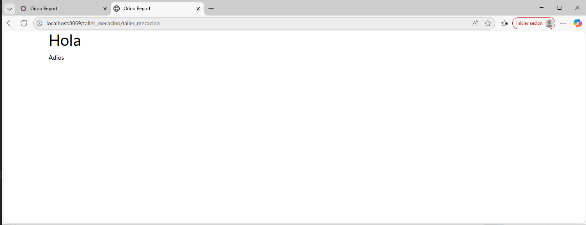
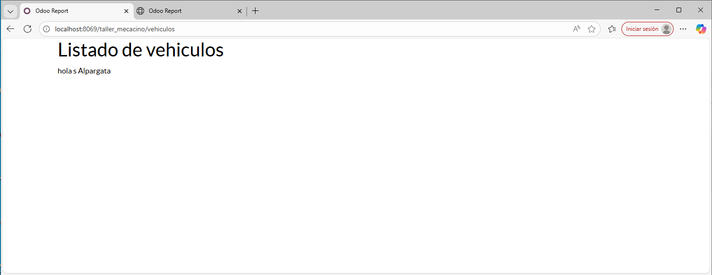

# Página estática y dinámica básica

En esta práctica te familiarizarás con los fundamentos básicos de Web Controllers en Odoo creando una página estática y una generada dinámicamente.

## Estructura del controller
Para esta practica lo primero que haremos es ir a la carpeta *controllers/controller.py*

Donde el contenido es el siguiente:
```py
# -*- coding: utf-8 -*-
from odoo import http
from odoo.http import request

class TallerMecacino(http.Controller):
    @http.route('/taller_mecacino/taller_mecacino', auth='public', website=True, type='http')
    def index(self, **kw):
        return http.request.render('taller_mecacino.static_web', {})

class TallerMecacinoDina(http.Controller):
    @http.route('/taller_mecacino/vehiculos', auth='public', website=True, type='http')
    def vehiculos(self, **kw):
        matricula = request.env['taller_mecacino.vehiculo'].search([])
        return http.request.render('taller_mecacino.dinamic_web', {
            'matriculas' : matricula
        })
```
Aqui como podemos ver creamos la url (o el accesso: ```@http.route('/taller_mecacino/vehiculos', auth='public', website=True, type='http')```. 
- **auth:** esto es para indicar que la visibilidad va a ser publica.
- **type:** esto es para indicar el tipo es decir que va http.

Ya todo lo demas es para indicar el contenido que va a tener esta URL

## Pagina estatica

```html
<odoo>
    <data>
        <template id="taller_mecacino.static_web" name="Una pagina estatica">
            <t t-call="web.html_container">
                <div class="container">
                    <h1>Hola</h1>
                    <p>Adios</p>
                </div>
            </t>
        </template>
    </data>
</odoo>
```
Como podemos ver lo que creamos un padre *odoo*, donde dentro ponemos el contenido que queremos tener en esta plantilla. 

```html
<odoo>
    <template id="taller_mecacino.dinamic_web">
        <t t-call="web.html_container">
            <div class="container">
                <h1>Listado de vehiculos</h1>
                <t t-foreach="matriculas" t-as="matri">
                    <div class="matri">
                        <span><t t-esc="matri.matricula"/></span>
                        <span><t t-esc="matri.marca"/></span>
                        <span><t t-esc="matri.modelo"/></span>
                    </div>
                </t>
            </div>
        </t>
    </template>
</odoo>
```
La estructura es la misma que la web estatica, pero con la diferencia de que aqui trabajamos usando ```t-foreach='matriculas' t-as='matri'``` Esta linea lo que hace es recorrer el objeto o modelo que se le paso en controller. 

**IMPORTANTE** aqui el nombre de *matriculas* debe ser el mismo que se le pasa en controller.
```py
return http.request.render('taller_mecacino.dinamic_web', {
            'matriculas' : matricula ## <--este matriculas debe llamarse igual
        })
```

## Resultado
### Pagina estatica


### Pagina dinamica
