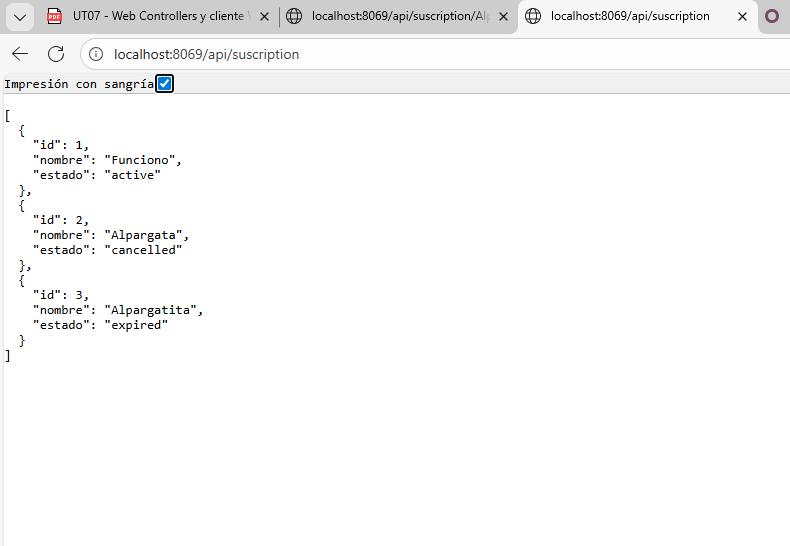
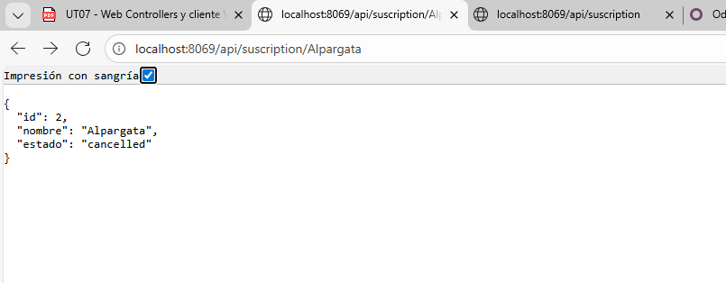

# API REST

Para esta practica editaremos el modulo *subcription* para que esta tenga don enlaces por el cual obtendremos unos datos

## Controller

```py
# -*- coding: utf-8 -*-
from odoo import http
from odoo.http import request, Response
import json

class SubscriptionController(http.Controller):
    @http.route('/api/suscription', auth='public', type='http', methods=['GET'], csrf=False)
    def getSubscripciones(self, **kwargs):
        estado = kwargs.get('status')
        estadoPer = ['active', 'pending']
        if estado:
            if estado not in estadoPer:
                return Response(json.dumps({'error': 'No se encuentra'}), status=400, content_type='application/json')
            impre = [('status', '=', estado)]
        else:
            impre = []
        subscriptions = request.env['subscription.subscription'].search(impre)
        
        result = []
        for sub in subscriptions:
            result.append({
                'id': sub.id,
                'nombre': sub.name,
                'estado': sub.status,
            })
        return Response(json.dumps(result), content_type='application/json')
    
    @http.route('/api/suscription/<string:name>', auth='public', type='http', methods=['GET'], csrf=False)
    def getSubscripcionesByNombre(self, name):
        subscription = request.env['subscription.subscription'].search([('name', '=', name)], limit=1)
        
        if not subscription:
            return Response(json.dumps({'error': 'No existe'}), status=404, content_type='application/json')
        
        result = {
            'id': subscription.id,
            'nombre': subscription.name,
            'estado': subscription.status,
        }
        
        return Response(json.dumps(result), content_type='application/json')
```

Como podemos ver la estructura base es igual que la que haciamos para la creacion de una web estatica y dinamica.
``` @http.route('/api/suscription/<string:name>', auth='public', type='http', methods=['GET'], csrf=False)```
Diferencia que podemos observar es:

- **methods=['GET']**: Con esto le indicamos que la URL que tendemos se encarga de hacer un GET de los datos.
  
```py
def getSubscripciones(self, **kwargs):
        estado = kwargs.get('status')
        estadoPer = ['active', 'pending']
        if estado:
            if estado not in estadoPer:
                return Response(json.dumps({'error': 'No se encuentra'}), status=400, content_type='application/json')
            impre = [('status', '=', estado)]
        else:
            impre = []
        subscriptions = request.env['subscription.subscription'].search(impre)
        
        result = []
        for sub in subscriptions:
            result.append({
                'id': sub.id,
                'nombre': sub.name,
                'estado': sub.status,
            })
        return Response(json.dumps(result), content_type='application/json')
```

En este codigo lo que hacemos es crear una funcion la cual obtenga todos los datos de aquellas subscripciones cuyo estado sea activo/inactivo. Si el estado no se encuentra en los marcados ```estadoPer = ['active', 'inactive']``` se imprimira por pantalla un error de estado 400.

```py
    @http.route('/api/suscription/<string:name>', auth='public', type='http', methods=['GET'], csrf=False)
    def getSubscripcionesByNombre(self, name):
        subscription = request.env['subscription.subscription'].search([('name', '=', name)], limit=1)
        
        if not subscription:
            return Response(json.dumps({'error': 'No existe'}), status=404, content_type='application/json')
        
        result = {
            'id': subscription.id,
            'nombre': subscription.name,
            'estado': subscription.status,
        }
        
        return Response(json.dumps(result), content_type='application/json')
```
 
En esta otra funcion permitimos pasar un parametro por URL para poder filtrar por el nombre de subcripcion ```subscription = request.env['subscription.subscription'].search([('name', '=', name)], limit=1)```. Es aqui donde se le indica que busque donde el nombre sea igual al nombre pasado-

**IMPORTANTE** el nombre *"name"* viene de un parametro de la funcion ```def getSubscripcionesByNombre(self, name)```. En el caso de que no se encuentre la subcripcion con el nombre marcado, se mostrara un error de estado 404 con el mensaje de ***error: no existe***

## Comprobacion
Get de todos los datos


Get de un dato en concreto
